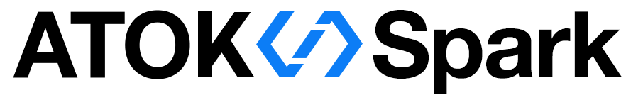
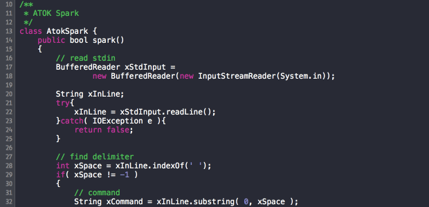
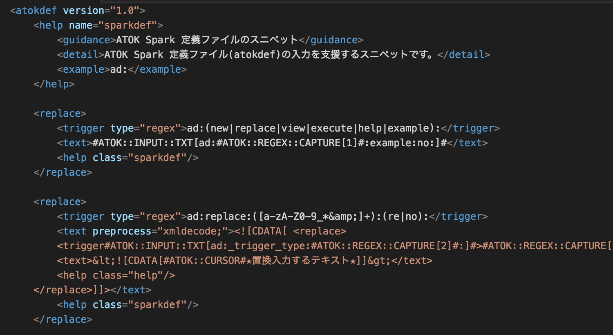
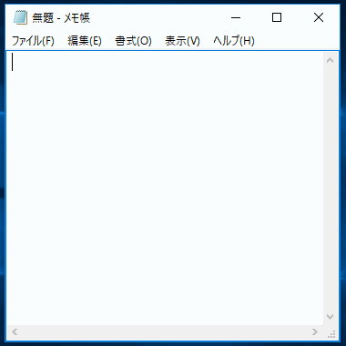
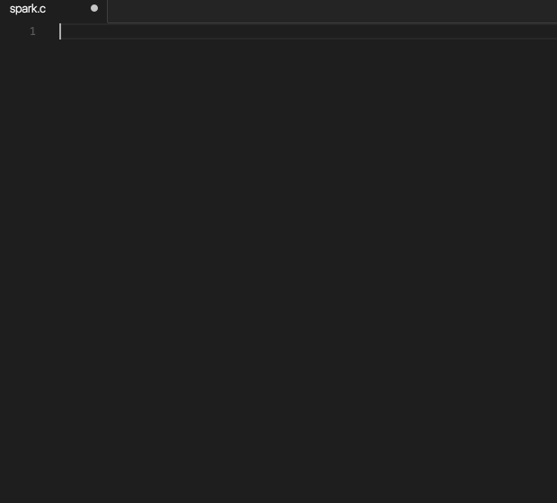
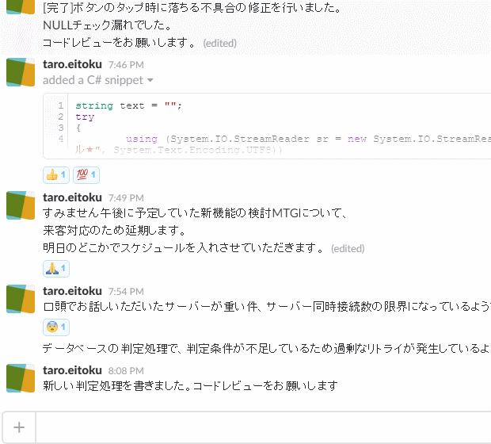
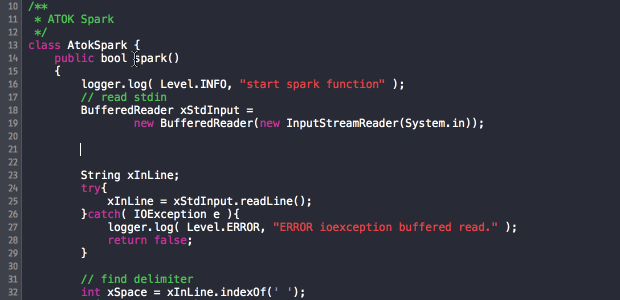

<a href="https://github.com/JustSystems/ATOK_Spark">
 
</a>

***
# <span style="color:red">**ATOK Spark 開発者＆ユーザーコミュニティ**</span>

こちらは **ATOK Spark** の開発者＆ユーザーコミュニティです。

Issues(投稿)を使ってコミュニティ運営しますので、**ATOK Spark** を使っていく中での不明点、Tips、利用例、  
要望などを自由に投稿してください。

**ATOK Spark** のコンセプトに共感していただける、あるいは開発に興味があるエンジニアの方が開発に参加い  
ただけるよう、今後ソースコードも公開していきます。

ソースコードを改変して機能追加することも可能となりますので、**ATOK Spark** の開発へ参加をお待ちしています。

<br>
***
# **ATOK Spark** とは

ジャストシステムは、あなたのことばをより確かに伝えるためのパートナーとなるよう、**ATOK**を創り続けて  
きました。これまでも、推測変換、校正支援、辞典検索など、さまざまな進化を続けてきましたが、これからも   
**ATOK** はコンピューターと人とをつなぐ一番身近な存在として、利用者と共に成長していきたいと考えています。  

<br>

**ATOK Spark** とは、定型フレーズ入力機能で開発業務を効率化する、エンジニア・Webデザイナ必携の入力支援ツールです。

**ATOK**の可能性をさらに広げ、また、文字入力のさらなる効率化の実現を目指して開発しています。

<br>
**ATOK Spark** を使ってみたいという方は、以下からダウンロードできます。  
[最新タグのダウンロードから](https://github.com/JustSystems/ATOK_Spark/releases)  
※ **ATOK Spark**には、日本語入力(かな漢字変換)機能は搭載されておりません。
<br>
***
# **ATOK Spark** の特長と機能  
<br>
**ATOK Spark**はシステムに常駐し、いつでも以下のような機能を利用することができます。  
<br>

### **★ 素早く入力『定型フレーズ入力』**  
<br>
キーボードで特定の文字列を打鍵すると、**ATOK Spark** は定型フレーズに置き換えます。  
<br>
<a>
　
</a>
<br>
<br>
<br>

### **★ 自分の好みに合わせて自由にカスタマイズ**   
<br>
定型フレーズの定義ファイルは、テキストファイルで用意されており、自由にカスタマイズできます。
<br>
定義ファイルはdef_fileフォルダに近日公開予定です。
<br>
<a>
　
</a>
<br>
<br>
<br>

### **★ Windowsでも、Macでも使える**  
<br>
**ATOK Spark** はWindowsでもMacでも利用できます。定義ファイルについても、１つの定義ファイルをWindowsとMacで共用することができます。
<br>
<a>
　
</a>
<a>
　
</a>
<br>
<br>
<br>

### **★  様々なソフトウェア上で使える**  
<br>
開発統合環境のエディタ上でも
<br>
<br>
<a>
　
</a>
<br>
<br>
チャットアプリ上でも
<br>
<br>
<a>
　
</a>
<br>
<br>
<br>

### **★ 素早く確認『閲覧機能』**  
<br>
本機能は、近日公開予定です。  

<br>
情報を確認したいときには、閲覧機能を利用して素早く確認できます。  
<br>
<a>
　
</a>
<br>
<br>
<br>

### **★ IME OFFの状態でも、かな漢字変換できる**    
<br>
本機能は、近日公開予定です。  
※ 本機能は、Windows版限定の機能となります。  
※ 動作のためには、ATOK 2016  for  Windows  が必要となります。  
<br>
<br>

***
# Issueには、こんな投稿が可能です

- **ATOK Spark** を使っている中での不明点

  - ATOK Sparkの使い方や、フレーズの定義方法など、どんな質問でもかまいません。
  
  - 定義ファイルの細かい仕様の確認などもどうぞ！

- **ATOK Spark** を使ってみた。

  - フレーズの定義例、機能アイディアなど何でも結構です。ぜひ自慢、提案してください！

  - 「こんな使い方だったら便利ですよ！」 など、ぜひシェアしてください！
  
- **ATOK Spark** の機能を開発してみたい。

  - 「こんな機能を作りたいのですが、**ATOK Spark** で開発できますか？」といった質問も大歓迎。  

<br>
例えば、以下のような投稿も歓迎です。

```
ATOK Spark フレーズ定義を作りました！ ぜひ使ってみてください！
```

```
動作しない！ 助けてください！
```

```
新しい機能を考えてみました。誰か実装してください！
```

<br>
***
# ご注意

こちらは**ATOK Spark**の全ユーザ向けのユーザーコミュニティです。

本コミュニティの運営には、コミュニティサポーターとしてジャストシステムのメンバーが参加します。  
ただし、回答の保証はありませんので、ご了承お願いいたします。  
<br>
投稿内容には、個人情報は含めないようお願いします。また、他者を誹謗中傷したり、公序良俗に  
反する内容を投稿しないようお願いします。公序良俗に反する内容が確認された場合には、  
管理者によってIssueをクローズする場合があります。  
<br>
投稿していただいた内容で問題が解決できた場合、他の開発者やユーザーにも参考になる情報となり  
ますので、特別な理由が無い限りIssueはクローズしないようお願いします。  

<br>
***
# 使用許諾契約
**ATOK Spark** をご利用の方は、[使用許諾契約書](/doc/eula.txt)をご確認いただき、内容に同意の上、  
ご利用いただきますようお願いします。  

<br>
***
# ダウンロード
Windows/Mac バイナリ公開中

[最新タグのダウンロードから](https://github.com/JustSystems/ATOK_Spark/releases)  
※ **ATOK Spark**には、日本語入力(かな漢字変換)機能は搭載されておりません。
***
